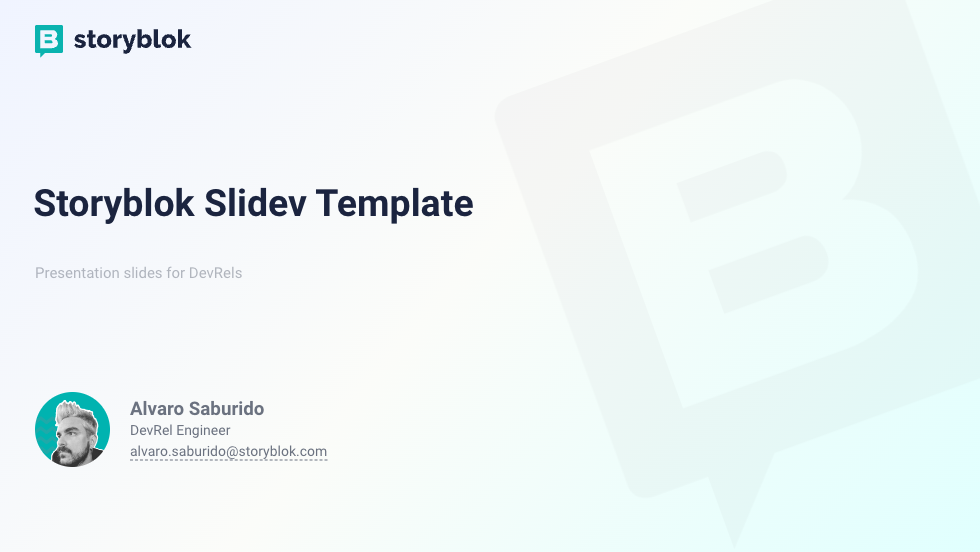
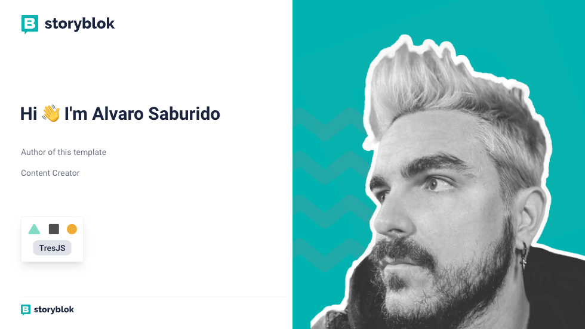

# slidev-theme-storyblok

[](https://www.npmjs.com/package/slidev-theme-storyblok)

A [Storyblok](https://www.storyblok.com/) theme for [Slidev](https://github.com/slidevjs/slidev).

<!--
  Learn more about how to write a theme:
  https://sli.dev/themes/write-a-theme.html
--->

<!--
  run `npm run dev` to check out the slides for more details of how to start writing a theme
-->

<!--
  Put some screenshots here to demonstrate your theme

  Live demo: [...]
-->

## Install

Add the following frontmatter to your `slides.md`. Start Slidev then it will prompt you to install the theme automatically.

<pre><code>---
theme: <b>storyblok</b>
---</code></pre>

Learn more about [how to use a theme](https://sli.dev/themes/use).

## ThemeConfig

```
---
themeConfig:
  presenter: 'Alvaro Saburido'
  presenterTitle: 'DevRel Engineer'
  presenterAvatar: 'https://res.cloudinary.com/alvarosaburido/image/upload/v1690529819/avatar_storyblok.png'
  presenterEmail: 'alvaro.saburido@storyblok.com'
---
```

## Layouts

This theme provides the following layouts:

### Intro `intro`

Usage:

- Add `intro` in the layout field.

```
---
layout: intro
---
```



### Cover `cover`

Cover is the default layout when none is specified.


Usage:

- Add `cover` in the layout field.

```
---
layout: cover
---
```


### Presenter `presenter`

Usage:

- Add `presenter` in the layout field.

```
---
layout: presenter
---
```



### Image Right `image-right`

Shows an image on the right side of the screen, the content will be placed on the left side.

Usage:

```md
---
layout: image-right

# the image source
image: ./path/to/the/image

---
```


### Image left `image-left`

Shows an image on the left side of the screen, the content will be placed on the right side.

Usage:

```md
---
layout: image-left

# the image source
image: ./path/to/the/image

---
```


### New Section `section`

Usage:

- Add `section` in the layout field.

```
---
layout: section
---
```


### Text Window `text-window`

Usage:

- Add `text-window` in the layout field.

```
---
layout: text-window
---

# Consoles

Use code snippets and get the highlighting directly into a nice looking window!

::window::

```ts
// main.ts

import { defineNuxtConfig } from "nuxt";

export default defineNuxtConfig({
  modules: ["@storyblok/nuxt"],
  storyblok: {
    accessToken: "<your-access-token>"
  }
});

```


### Two Columns `two-cols`
Separates the page content in two columns.

Usage:

```md
---
layout: two-cols
---

# Left

This shows on the left

::right::

# Right

This shows on the right

```


## TODO

- [ ] Add more layouts (iframe)
- [ ] Better shiki theme

## Contributing

- `npm install`
- `npm run dev` to start theme preview of `example.md`
- Edit the `example.md` and style to see the changes
- `npm run export` to generate the preview PDF
- `npm run screenshot` to generate the preview PNG
